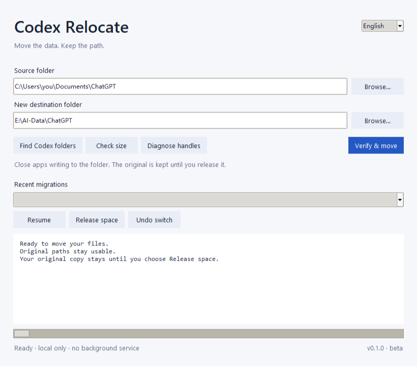
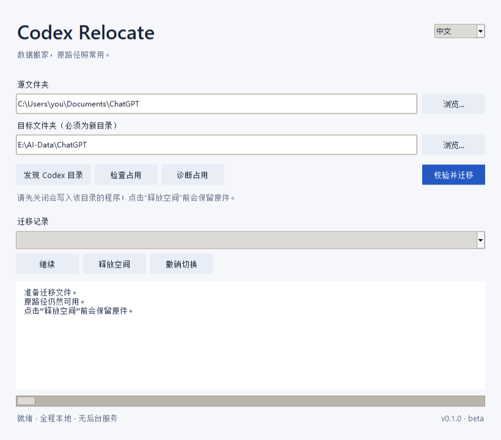

# Codex Relocate

**Move the data. Keep the path.**

A small, offline Windows utility for moving ChatGPT / Codex folders to a roomier drive. It verifies file contents, keeps the original path working through an NTFS junction, and tells you when space has actually been released.

[Download for Windows](https://github.com/ASEXPIAO/codex-relocate/releases) · [中文](#中文) · [Recovery & limitations](docs/SAFETY.md)



## Why this exists

A real migration got stuck after the files had already been copied. Repeated app restarts, elevated scripts, and stopping a background service did not help. File Explorer still held directory handles inside the source tree.

This project turns that experience into a focused workflow: **inspect → verify → switch → release**. “Copied” and “space freed” are different states.

## What you get

- **One window.** English by default; switch to 中文. No account, telemetry, updater, service, or startup task.
- **Useful discovery.** Finds common document, `.codex` / `CODEX_HOME`, and runtime-cache locations. Existing links show their physical target instead of inflating C: usage.
- **Handle diagnostics.** Shows accessible processes and matching open paths. No process killing or forced handle closure.
- **Content verification.** SHA-256 for every regular file and NTFS named stream, with separate checks for directory links. Links are never recursively followed during cleanup.
- **Recoverable steps.** Retain the original after switching; resume an interrupted job or undo the switch before releasing the old copy.
- **Honest results.** Reports actual drive free-space change, which can also be affected by other applications.

## Use it

Windows 10/11 x64, fixed local NTFS drives. This is an **unofficial beta**, independent of OpenAI.

1. Download `Codex-Relocate-Windows-x64.zip` from [Releases](https://github.com/ASEXPIAO/codex-relocate/releases), extract it, and open `CodexRelocate.exe`. Keep the included `_internal` folder next to the executable. No Python installation needed. Builds are unsigned; `SHA256SUMS.txt` is provided with each release.
2. Close ChatGPT/Codex and other programs writing to the selected folder. Run this utility separately from the app you are moving.
3. Select the source and a **new, nonexistent destination folder**, such as `E:\AI-Data\ChatGPT`. The destination's parent must exist.
4. Optionally use **Check size** and **Diagnose handles**, then **Verify & move**.
5. After the switch, choose **Release space** to recheck both copies and delete the retained original. Alternatively choose **Undo switch**. Do this before reopening apps that will modify the data.

The old path remains usable. Future writes through that path go to the destination drive. Leave the junction in place and keep the destination drive available.

**If anything changes after the switch, automatic release/undo stops and preserves the original.** This is intentional: the tool does not guess which version of your work to discard.

## Run from source

Python 3.9+ with Tkinter; no runtime packages to install. A current supported Python version is recommended.

```powershell
python -m codex_relocate
```

Or double-click `Start.cmd` with Python on PATH.

The same engine is available from the command line:

```powershell
python -m codex_relocate scan
python -m codex_relocate scan "C:\Users\you\Documents\ChatGPT"
python -m codex_relocate diagnose "C:\Users\you\Documents\ChatGPT"
python -m codex_relocate move "C:\Users\you\Documents\ChatGPT" "E:\AI-Data\ChatGPT"
python -m codex_relocate jobs
python -m codex_relocate resume JOB_ID
python -m codex_relocate release JOB_ID --yes
# Before release, if neither copy has changed:
python -m codex_relocate rollback JOB_ID --yes
```

Progress goes to stderr; command results are JSON on stdout. The packaged executable accepts the same arguments. Job records stay locally in `%LOCALAPPDATA%\CodexRelocate\jobs`.

## Scope

This moves **local folders on the same computer**. It does not move WindowsApps or installed application binaries, rewrite conversation databases, transfer cloud chats, or migrate between computers.

Both paths must be physical, non-overlapping directories on fixed NTFS volumes. Cloud placeholders, EFS-encrypted files, directory named streams, network/removable drives, and relative links escaping the source are rejected. Existing destinations are never merged. File hard-link relationships and directory timestamps are not preserved; copied files can therefore use more space than their original physical allocation. See [the safety and recovery notes](docs/SAFETY.md).

An open handle is **evidence**, not proof that a process blocks renaming. Diagnostics are best-effort and time-bounded; protected processes may be inaccessible. The tool never claims an empty result guarantees no locks.

## Development

```powershell
python -m unittest discover -s tests -v
python -m pip install pyinstaller==6.16.0
python -m PyInstaller --noconfirm --clean --onedir --name CodexRelocate run.py
```

Windows integration tests exercise actual junctions, named streams, Unicode/long paths, locked directories, changed data, interrupted operations, and no-follow cleanup. CI runs on multiple Python versions. General availability across every Windows configuration is not claimed.

## Related work

[state-guardian](https://github.com/YU123-ZZZ/ChatGPT-Codex--state-guardian) covers Codex state backup and D: relocation; [windows-disk-cleanup](https://github.com/vhaozheng/windows-disk-cleanup) offers general folder migration as a skill; [Codex Lifeboat](https://github.com/dkwolf1/Codex-Lifeboat) and [codex-rehome](https://github.com/CalebYcj/codex-rehome) focus on cross-computer migration. Codex Relocate focuses on a small same-computer UI, handle diagnosis, and verified release of the old copy. It is an independent implementation, not a fork of those projects.

MIT licensed. [Contributions](CONTRIBUTING.md) welcome—especially reproducible Windows edge cases with synthetic files.

---

## 中文

**数据搬家，原路径照常用。**

一个轻量、离线的 Windows 工具，把 ChatGPT / Codex 的本地文档、状态或缓存目录搬到空间更大的盘。默认英文界面，右上角可切换中文。



### 为什么做

一次真实迁移中，文件早已复制完成，却反复卡在最后切换。退出应用、管理员脚本、停止后台服务都没有解决问题；最后发现是文件资源管理器还握着子目录句柄。

所以工具把“复制完成”“路径切换”“真正释放空间”分开显示，并提供占用诊断和恢复记录。

### 怎么用

1. 从 [Releases](https://github.com/ASEXPIAO/codex-relocate/releases) 下载 Windows ZIP，解压后打开 `CodexRelocate.exe`，保留旁边的 `_internal` 目录。无需安装 Python。
2. 关闭 ChatGPT/Codex，以及会写入目标目录的其他程序；独立运行本工具。
3. 选择源目录和**尚不存在的目标目录**，例如 `E:\AI-Data\ChatGPT`，上级目录需要已存在。
4. 点击“检查占用”或“诊断占用”，然后“校验并迁移”。
5. 切换成功后，在重新打开会写入数据的应用前，点击“释放空间”；也可选择“撤销切换”。释放前会再次校验，两份数据发生变化就停止并保留原件。

原路径会成为指向目标盘的目录链接，以后经原路径保存的新文件也落到目标盘。不要删除这个入口，也不要断开目标盘。

### 做了哪些保护

- 全文件 SHA-256 校验，包含 NTFS 附加数据流；内部链接单独校验，清理不跟随链接。
- 明确展示占用进程和路径，不强杀进程、不强关资源管理器。
- 保留原副本后再切换，提供中断恢复；释放原副本前可撤销。
- 不覆盖已有目标目录，不自动合并新旧版本。
- 显示磁盘实际可用空间变化；不把“已复制”当作“已释放”。

仅支持 Windows 10/11、本机固定 NTFS 磁盘。**这是非官方测试版，不是 OpenAI 产品。**不搬应用安装目录，不修改聊天数据库，不迁移云端聊天；不支持云盘占位文件、EFS 加密文件和网络盘等情形。详见[恢复与边界说明](docs/SAFETY.md)。

程序不联网，不上传文件、目录清单或聊天记录；没有常驻服务、自启动或自动更新。发布包未进行商业代码签名，可核对随版本提供的 SHA-256。源码使用 Python 标准库和 Tkinter，MIT 开源。
